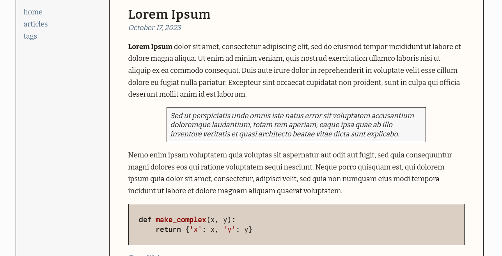
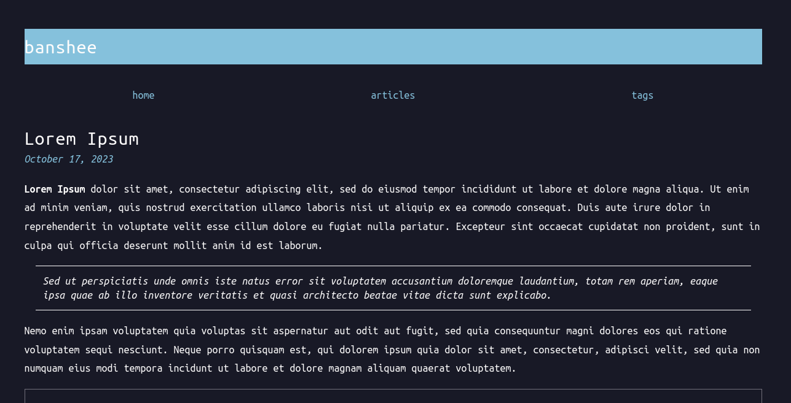
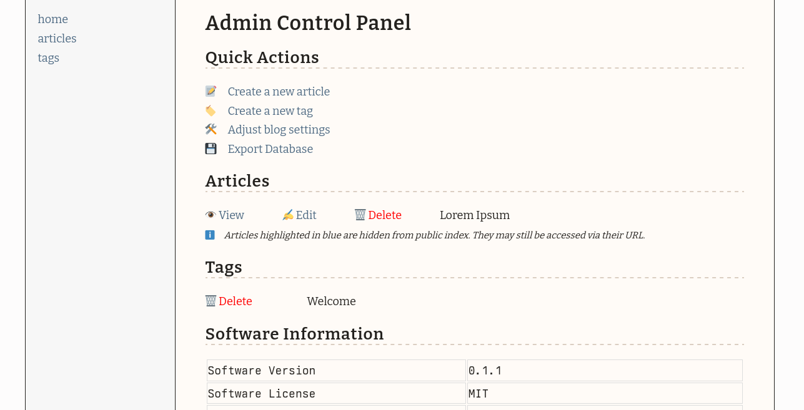

<p align="center">
  <h2 align="center">Banshee</h2>
</p>

Banshee is a lightweight, database-backed blogging software hand-written for my personal website. It is intended to be easy to set up and use while also maintaining flexibility and speed. 

Supports:
  - Automatic creation of an RSS feed
  - Point-and-click administration and publishing
  - Hidden articles
  - Tagging functionality

It even comes with some themes!




Additionally, administration is primarily done through an included administrative interface:



# Installation
## Database Setup
Run the included install script to create the appropriate database tables. Update `includes/config.php` accordingly with the new database information.

## Apache Configuration
The following configuration is recommended. The `Content-Security-Policy` header allows for the loading of the pre-packaged instance of `highlight.js` only. This will need to be modified if you plan to add additional script functionality to your blog.

It is very important that the `/admin` directory be password protected! This blog software does not come with authentication features, that is left to the web server itself!

```
ServerName blog.example.com
DocumentRoot /var/www/blog.example.com/htdocs

Header always append X-Content-Type-Options nosniff
Header always append X-Frame-Options deny
Header set Content-Security-Policy "default-src 'none'; img-src 'self' data:; media-src 'self'; script-src 'self' 'sha256-O6piNkhLv4BI/Oje+MccCmgUSrS1sIp+CMaOsvD/VWU='; style-src 'self' 'unsafe-inline' data:; font-src 'self' data:; object-src 'none'; base-uri 'self'; connect-src 'self'; form-action 'self'; frame-ancestors 'self'"

ErrorDocument 404 /resource/404.php
ErrorDocument 401 /resource/401.php

<Directory "/var/www/blog.example.com/htdocs/admin">
        AuthType Basic
        AuthName "Restricted"
        AuthUserFile /etc/apache2/.htpasswd
        Require valid-user
</Directory>
```